# 🔬 Smart Research Assistant

<div align="center">


**AI-powered research management system built with Spring Boot, Spring AI, and Google Gemini API**

[Features](#-key-features) • [Architecture](#-system-architecture) • [Getting Started](#-getting-started) • [Documentation](#-detailed-workflow) • [API](#-api-reference)

</div>

---

## 📑 Table of Contents

- [Overview](#-overview)
- [Key Features](#-key-features)
- [System Architecture](#-system-architecture)
- [Detailed Workflow](#-detailed-workflow)
- [Tech Stack](#-tech-stack)
- [Getting Started](#-getting-started)
- [Project Structure](#-project-structure)
- [Configuration](#-configuration)
- [Testing](#-testing)

---

## 🎯 Overview

The **Smart Research Assistant** is a modern web application that leverages Google's Gemini AI to help researchers and students organize, summarize, and manage their research notes efficiently. The application features a clean, intuitive interface with real-time AI-powered summarization capabilities.

### 🌟 Key Features

<table>
<tr>
<td width="50%">

#### 🤖 AI-Powered Features
- ✨ **Instant Summarization** - Real-time text analysis with Gemini
- 🧠 **Context-Aware Processing** - Intelligent content understanding
- 🔄 **Multi-Model Support** - Flexible AI model integration
- 📊 **Token Analytics** - Track API usage and optimization

</td>
<td width="50%">

#### 📝 Research Management
- 📚 **Note Organization** - Structured multi-part documents
- 🏷️ **Smart Tagging** - Categorize and filter research
- 🔍 **Advanced Search** - Find notes quickly
- 💾 **Auto-Save** - Never lose your work

</td>
</tr>

</table>

---

## 🏗️ System Architecture

### High-Level Architecture

```mermaid
graph TB
    subgraph Client["🌐 Client Layer"]
        Browser["Web Browser"]
        Mobile["Mobile Device"]
    end
    
    subgraph Frontend["💻 Frontend Layer"]
    end
    
    subgraph Backend["⚙️ Spring Boot Backend"]
        Controller["🎮 Controller Layer<br/>REST Endpoints"]
        Service["⚡ Service Layer<br/>Business Logic"]
        Repository["💾 Repository Layer<br/>Data Access"]
    end
    
    subgraph Integration["🔌 Integration Layer"]
        SpringAI["Spring AI Framework"]
        GeminiService["Gemini Service"]
    end
    
    subgraph External["☁️ External Services"]
        GeminiAPI["Google Gemini API"]
        Database["MongoDB/PostgreSQL"]
    end
    
    Browser --> Frontend
    Mobile --> Frontend
    Frontend --> Controller
    Controller --> Service
    Service --> GeminiService
    Service --> Repository
    GeminiService --> SpringAI
    SpringAI --> GeminiAPI
    Repository --> Database
    
    style Client fill:#e1f5ff
    style Frontend fill:#fff4e1
    style Backend fill:#e8f5e9
    style Integration fill:#f3e5f5
    style External fill:#fce4ec
```



### Component Architecture


### Request Flow Architecture

```mermaid
sequenceDiagram
    participant U as 👤 User
    participant F as 🌐 Frontend
    participant C as 🎮 Controller
    participant S as ⚡ Service
    participant AI as 🤖 Spring AI
    participant G as ☁️ Gemini API
    participant DB as 💾 Database
    
    U->>F: Select text & click "Summarize"
    F->>C: POST /api/v1/research/summarize
    C->>C: Validate request
    C->>S: generateSummary(request)
    S->>S: Build prompt
    S->>AI: call(prompt)
    AI->>G: HTTP Request
    G->>G: Process with AI model
    G-->>AI: Return summary
    AI-->>S: ChatResponse
    S->>S: Format response
    S->>DB: Save to history (optional)
    S-->>C: SummaryResponse
    C-->>F: JSON Response
    F-->>U: Display summary
```



---

## 📊 Detailed Workflow

### Phase 1: Text Summarization Pipeline

```mermaid
graph TD
    A[👤 User selects text] --> B{Text valid?}
    B -->|No| C[❌ Show error]
    B -->|Yes| D[📤 Send to API]
    
    D --> E[🎮 Controller receives request]
    E --> F[✅ Validate input]
    F --> G[⚡ GeminiService.generateSummary]
    
    G --> H[🔨 Build AI prompt]
    H --> I[📝 Add context & instructions]
    I --> J[🤖 Call Spring AI]
    
    J --> K[☁️ Gemini API processing]
    K --> L[🧠 AI model generation]
    L --> M[📊 Token calculation]
    
    M --> N[✨ Format response]
    N --> O[📈 Add metadata]
    O --> P[💾 Cache result optional]
    
    P --> Q[📤 Return to frontend]
    Q --> R[🎨 Render summary]
    R --> S[💚 Show success message]
    
    style A fill:#e3f2fd
    style K fill:#f3e5f5
    style R fill:#e8f5e9
```



### Phase 2: Note Management Flow


### Phase 3: Query & Retrieval Flow

```mermaid
graph LR
    A[🔍 User Search] --> B{Query Type}
    
    B -->|By ID| C[Direct Fetch]
    B -->|By Filter| D[Filter Query]
    B -->|Full Text| E[Search Index]
    
    C --> F[(Database)]
    D --> F
    E --> G[(Search Engine)]
    
    F --> H[📋 Results]
    G --> H
    
    H --> I{Transform}
    I --> J[DTO Mapping]
    J --> K[Add Metadata]
    K --> L[Pagination]
    
    L --> M[📤 API Response]
    M --> N[🎨 Render UI]
    
    style A fill:#e1f5ff
    style H fill:#fff4e1
    style N fill:#e8f5e9
```




## 🛠️ Tech Stack

### Backend Technologies


### Frontend Technologies


## 🚀 Getting Started

### Prerequisites Checklist

```mermaid
graph LR
    A[✅ Prerequisites] --> B[Java 17+]
    A --> C[Maven 3.8+]
    A --> D[IDE]
    A --> E[Git]
    A --> F[Gemini API Key]
    
    B --> B1[java -version]
    C --> C1[mvn -version]
    D --> D1[IntelliJ IDEA]
    D --> D2[VS Code]
    E --> E1[git --version]
    F --> F1[Google Cloud Console]
    
    style A fill:#4CAF50,color:#fff
```



### Installation Steps


### Quick Start Commands

```bash
# 1️⃣ Clone the repository
git clone https://github.com/yourusername/smart-research-assistant.git
cd smart-research-assistant

# 2️⃣ Set up configuration
cp src/main/resources/application.properties.example src/main/resources/application.properties
# Edit application.properties and add your Gemini API key

# 3️⃣ Install dependencies
mvn clean install

# 4️⃣ Run the application
mvn spring-boot:run

# 5️⃣ Access the application
# Open browser: http://localhost:8080
```

### Configuration Guide

Create `src/main/resources/application.properties`:

```properties
# ============================================
# Server Configuration
# ============================================
server.port=8080
server.servlet.context-path=/

# ============================================
# Spring Application
# ============================================
spring.application.name=smart-research-assistant

# ============================================
# Gemini AI Configuration
# ============================================
spring.ai.gemini.api-key=${GEMINI_API_KEY:your-api-key-here}
spring.ai.gemini.model=gemini-pro
spring.ai.gemini.temperature=0.7
spring.ai.gemini.max-tokens=2048

# ============================================
# Database Configuration (MongoDB)
# ============================================
spring.data.mongodb.uri=mongodb://localhost:27017/research_assistant
spring.data.mongodb.database=research_assistant

# ============================================
# Logging Configuration
# ============================================
logging.level.root=INFO
logging.level.com.yourpackage.research=DEBUG
logging.pattern.console=%d{yyyy-MM-dd HH:mm:ss} - %msg%n

# ============================================
# Cache Configuration
# ============================================
spring.cache.type=simple
spring.cache.cache-names=summaries,notes
```

---

## 📁 Project Structure


### Key Components Description


### Endpoint Documentation

#### 1. Summarize Text


**Request:**
```json
{
  "text": "Your research content here...",
  "options": {
    "maxLength": 150,
    "style": "academic",
    "language": "en"
  }
}
```

**Response:**
```json
{
  "summary": "Generated summary...",
  "metadata": {
    "wordCount": 42,
    "processingTime": 1250,
    "model": "gemini-pro"
  }
}
```

#### 2. Create Note


#### 3. API Status Codes


---

## 🧪 Testing

### Test Architecture


### Test Coverage Flow


### Running Tests

```bash
# Run all tests
mvn test

# Run with coverage
mvn test jacoco:report

# Run specific test class
mvn test -Dtest=GeminiServiceTest

# Run integration tests only
mvn verify -P integration-tests

# Generate coverage report
mvn clean test jacoco:report
# View report: target/site/jacoco/index.html
```

## 📝 License

This project is licensed under the MIT License - see the [LICENSE](LICENSE) file for details.

---

## 👥 Support & Community

<div align="center">

### 💬 Get Help

[](https://github.com/Marouazzz/research-assistant/issues)


### ⭐ Show Your Support

If you find this project helpful, please consider giving it a star!

[](https://github.com/Marouazzz/research-assistant)

</div>

---

<div align="center">

**Made with ❤️ by MAROUAZZZ**

*Powered by Spring Boot • Enhanced by AI • Built for Researchers*

</div>
